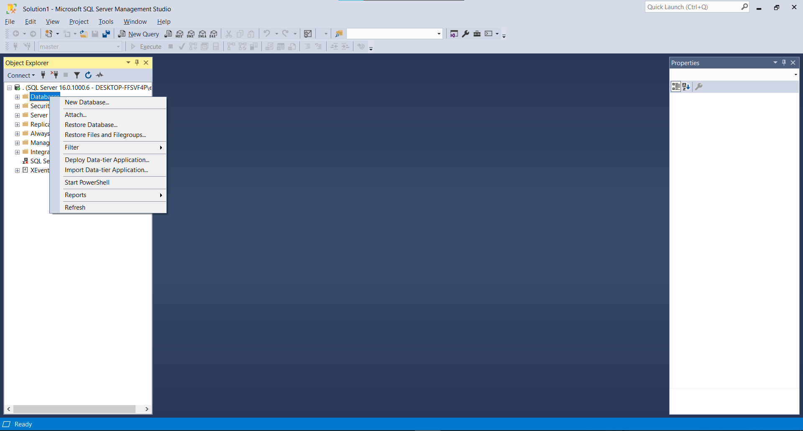
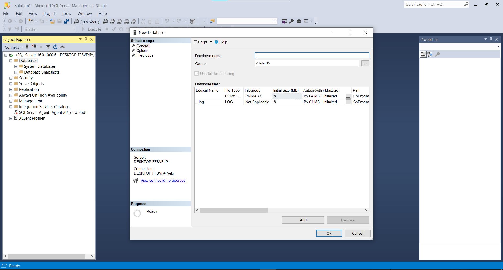
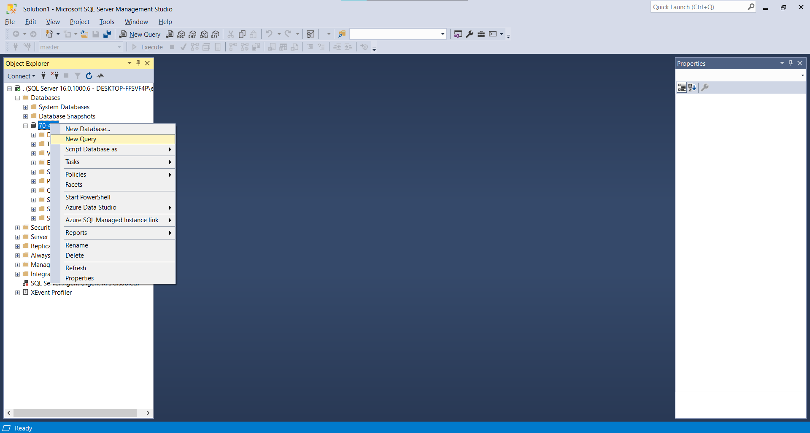
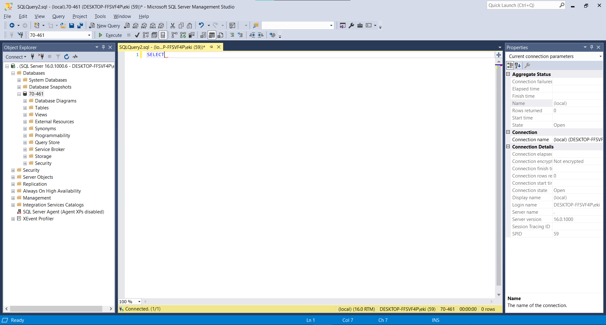
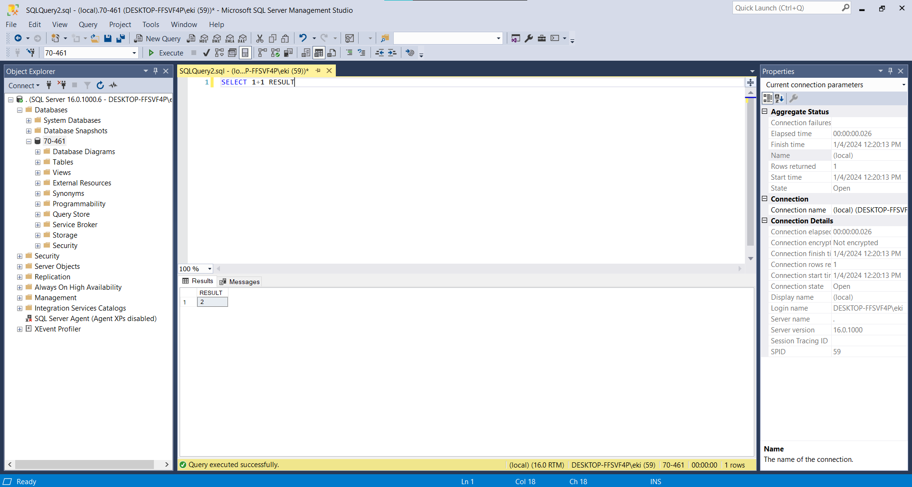
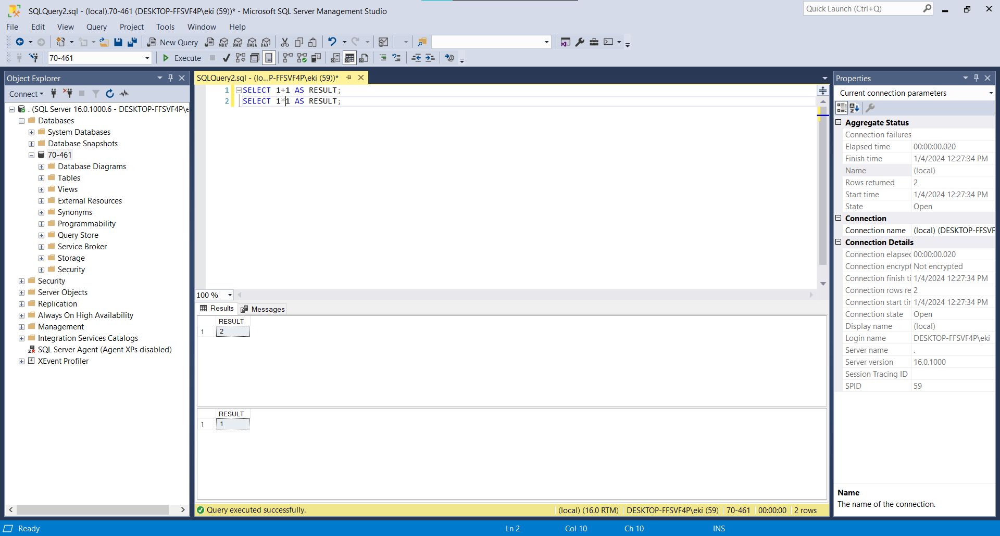
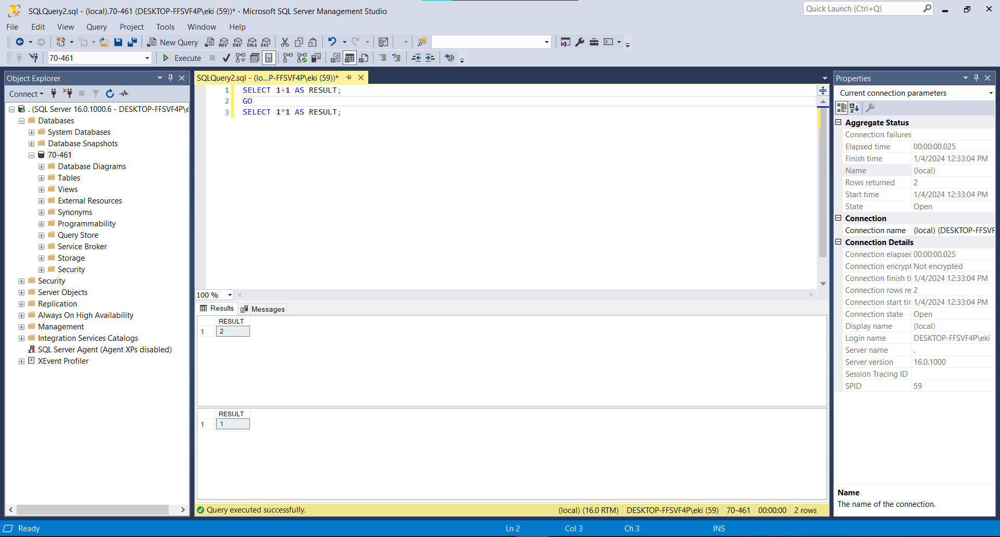

# Section 2 - Session 1 - Starting SQL Server

- ## Creating a database

A database is nothing more than a container of tables, queries, functions, etc... It is also a holder of security to ensure that people who don't have access to the database can't get in.

To create a database, do the following:

  - Right-click on the word **Databases** in the **Object Explorer** and click new Database:



  - Add a name for the database and click **OK**



- ## Creating our first query

Every query is run in the context of a database.

We already have a database. To create a query, right-click on the database and click new query:



We now have a new query window:


Inside our query window, write the word ```SELECT```, SELECT is needed on absolutely every single query that we will write. It's the equivalent of ```print``` in other languages.



Notice that there is a wavy red line, which means that we are not complete yet, there is a syntax error, to complete the statement, we can add a space then 1+1.


Then press **Execute**. We can see the answer. 


Notice it is on row number 1, with no column name. Because this is a database, every single column needs a column name or it will appear just like in the picture above. To add a column name just add another space and put the column name, in this case, I will use RESULT 



Now, we have the word RESULT as the column header. This is syntactically valid but it is a bit too informal. If we put the word AS before the heading name we can see that the word RESULT and AS are colored in blue, this is because they are official keywords, 1+1 and RESULT are not.


If you know other programming languages, you might use semi-colons to end a line, and that's fine too. semi-colons are optional. 

Now, if we do the same thing but with different operation, we will get 2 outputs



We can also make this a bit clearer by adding the word GO in between the lines. Why? Notice that we now have a minus sign joining lines 1 through 3


This is basically saying that this is all a batch. A batch is something that is to be executed all at once. Now, if we type the word GO, this interrupts where the batch is. It is basically saying this is the end of the batch, do it. 


