# Creating tables

## Using GUI

Right-click on the tables folder inside the database and select the new table:

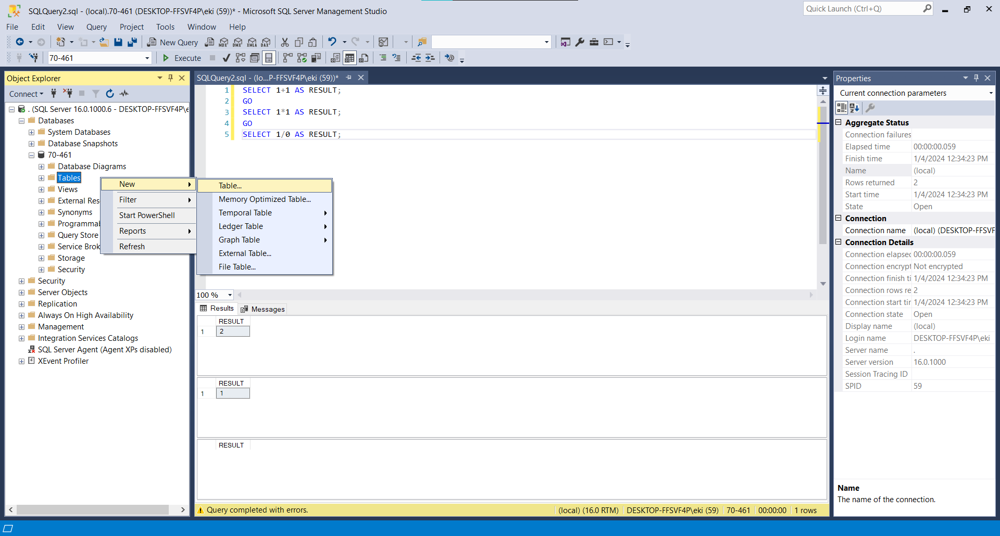

It will then show us this:

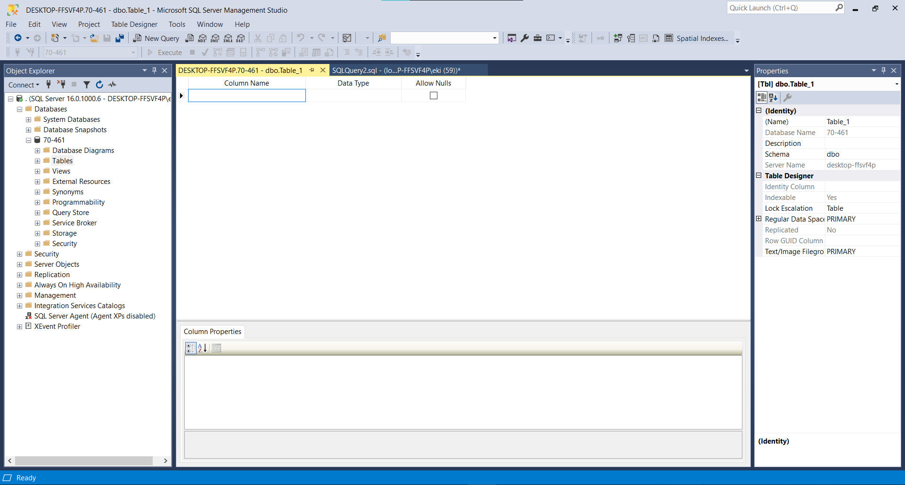

It's going to ask us what column name we need, and what data type. If we save it, it will ask for a Table name (field name) -> We have a database, inside a database is a table, and inside a table is a field.

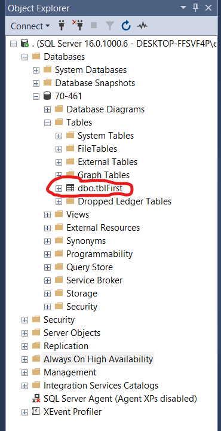

As we can see, the table that we just made is inside the table. ```dbo``` is a sort of standard name, it stands for database owner.

## Using T-SQL 

First, make a new query inside the database then:

- Write: ```CREATE TABLE (tablename)```
- We need to create ```parameters``` The parameters in this case are the field name and the field type and we include them using parenthesis and separate them using a space

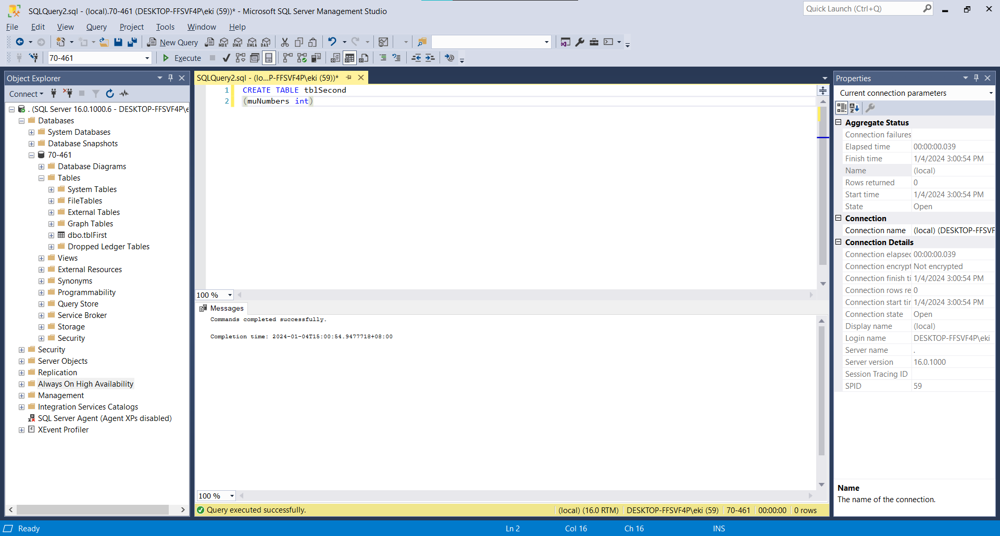

And we can also see it inside the table as a field

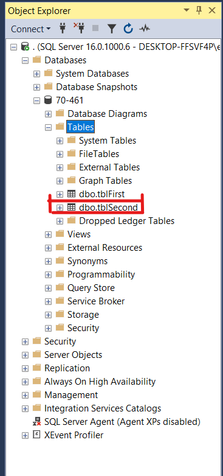

In addition, you can also add the GO keyword at the end of it:

```sql
CREATE TABLE tblSecond
(myNumbers int);
GO
```

## Adding values to the table (using GUI)

- Write click your table then select ```Edit Top 200 Rows```, don't click on ```Select top 1000 rows``` because it will show them all down but we won't be able to edit any rows while Edit Top 200 rows, we'll be able to add new rows as well.

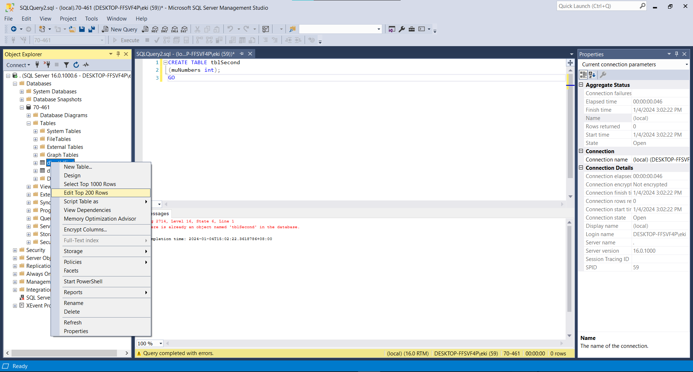

Then we will see this:

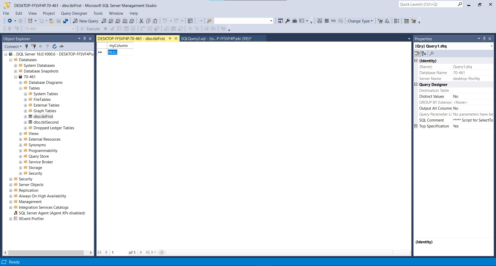

Since our data type is ```int (integers)``` we can add any integer value in the table:

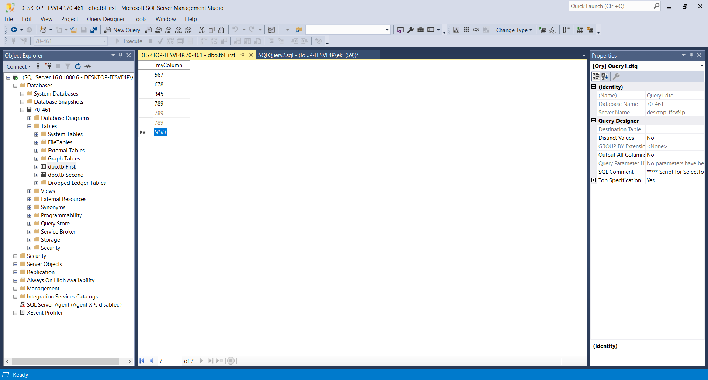

## Adding values to the table (using T-SQL)

- We can do this with the ```INSERT INTO (table name)``` then ```VALUES (value)```

```sql
INSERT INTO tblSecond
VALUES (234)
```

If you execute this it will be executed but you will notice a wavy red line under the table name, just hit (Crtl + Shift + R) to refresh the local cache.

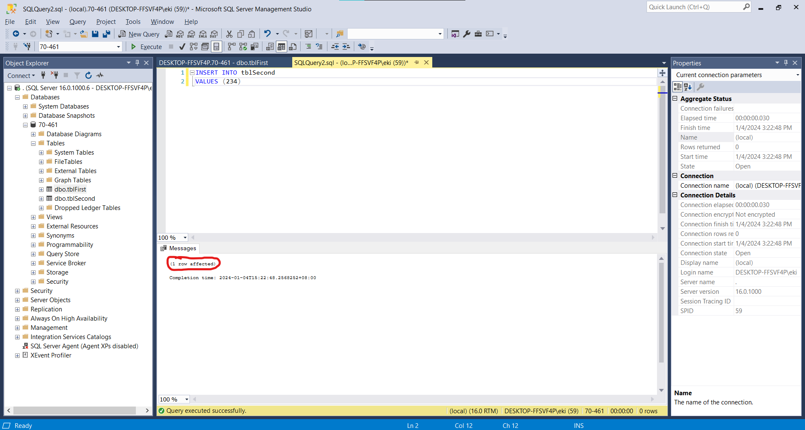

You can also do it like this (adding values on separate line does not matter):

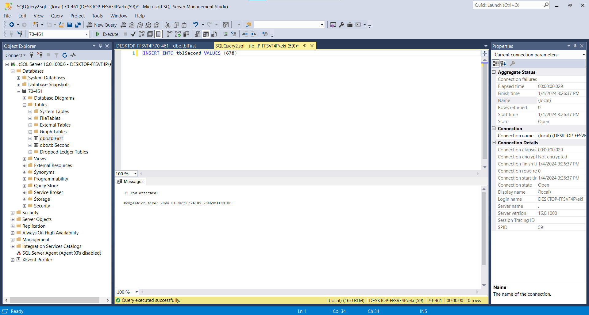

If we want to add more than 1 row, we can do that by:

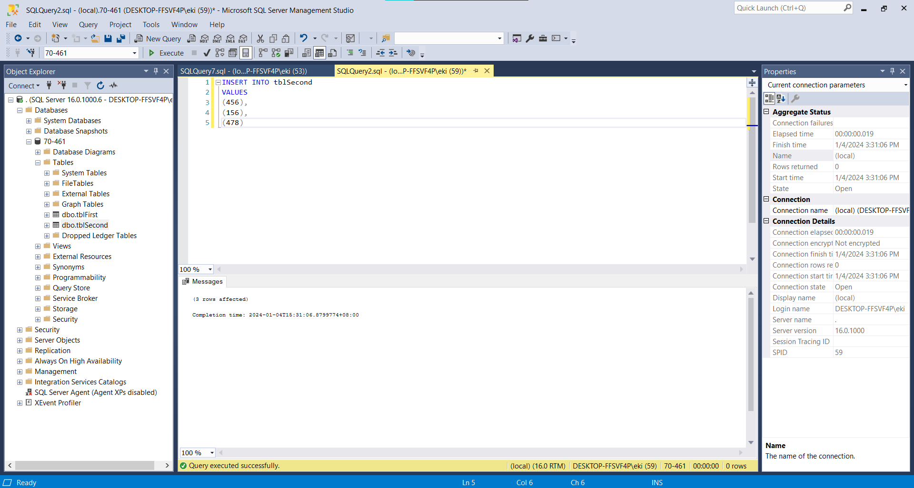

**QUICK NOTE:** 

When you insert values into this table using:

```sql
INSERT INTO tblSeconds
VALUES (12), (34), (56);
```

You're adding three separate rows to the table, each with a single value in the myNumbers column.

Now, let's contrast this with:

```sql
INSERT INTO SportTeams
VALUES (23, 'Wolf FC', 2, 3);
```

In this case, you're inserting a single row with values for all columns of the SportTeams table. The values are provided in the order in which the columns were defined when you created the table (TeamID, TeamName, Attack, Defense).


